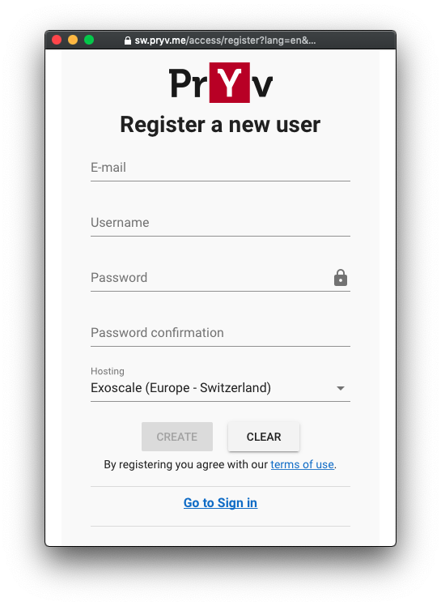
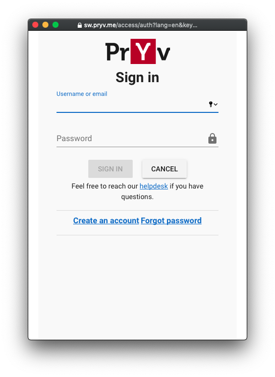
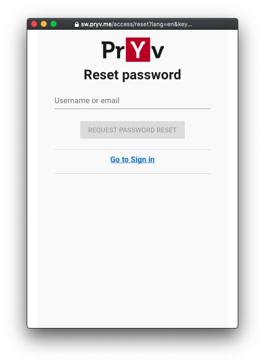

# Authorization web app (app-web-auth v3)

Pryv.io web pages for app authorization, user registration and password reset

This is a **Template App** developped with [Vue.js](https://vue.js) to be adapted and refactored for each Pryv.io deployment. It can also be used as reference if you prefer to use another framework.

These web pages are the "popup frame" that opens during the [app authorization process](https://api.pryv.com/reference/#authorizing-your-app)

| Registration                                                 | Sign in                                                      | Consent                                                      | Reset-Password                                               |
| ------------------------------------------------------------ | ------------------------------------------------------------ | ------------------------------------------------------------ | ------------------------------------------------------------ |
|  |  |  |  |

# Document Content

- [Authentication and Access token creation flow](#authentication-and-access-token-creation-flow)
  * [Authorization flow](#authorization-flow)
  * [Register user flow](#register-user-flow)
  * [Reset password flow](#reset-password-flow)
  * [Operations in details](#operations-in-details)
    + [login](#login)
    + [checkAccess](#checkaccess)
    + [acceptAccess](#acceptaccess)
    + [refuseAccess](#refuseaccess)
    + [closeOrRedirect](#closeorredirect)
- [Development and Deployment](#development-and-deployment)
  * [Prerequisites](#prerequisites)
  * [Commands](#commands)
  * [Tests](#tests)
    + [rec-la for local manual test](#rec-la-for-local-manual-test)
      - [Testing Auth flow, with Rec-la](#testing-auth-flow-with-rec-la)
    + [Vue.js testing](#vuejs-testing)
    + [Publish to github pages](#publish-to-github-pages)
  * [Possible deployments and structure](#possible-deployments-and-structure)
    + [Use Symbolic Links](#use-symbolic-links)
    + [Use a reverse proxy, example with NGINX](#use-a-reverse-proxy-example-with-nginx)
  * [Assets & Visual Usage and Customization](#assets--visual-usage-and-customization)


# Authentication and Access token creation flow

In this section, we explain how the three main goals of app-web-auth3 are implemented; namely authorizing client applications, registering new Pryv users and resetting forgotten passwords. We first present the three flows and then give more details about each operation that takes part in these flows.

## Authorization flow

1. (This step is happening outside app-web-auth3)
  The client application performs an auth request, as explained [API doc - Authorizing your app](https://api.pryv.com/reference/#authorizing-your-app).
  From this request, the app receives an URL to open (e.g as a popup), which actually targets app-web-auth3 auth page.
  This URL transmits as query parameters the requesting permissions and requesting app id from the auth request. [API doc - Auth request](https://api.pryv.com/reference/#auth-request)
  
  This step can be tested with: 
  
  - [App web access](https://api.pryv.com/app-web-access/?pryvServiceInfoUrl=https://reg.pryv.me/service/info) on github.
  - [Simple web app](https://codepen.io/pryv/pen/ExVYemE) on code pen.
  
2. The app-web-auth3 auth page shows a form for a user to enter its Pryv.io username and password.

3. Clicking on Sign-in triggers a Pryv login ([login operation](#login)) and finally generates a personal token for this user. 

4. Using the personal token, the requested app access is checked, it produces a set of checkedPermissions (important details are being omitted here, see [checkAccess operation](#checkapp)).

5. The checkedPermissions are shown to the user, who can decide to Accept ([acceptAccess operation](#acceptaccess)) or Refuse ([refuseAccess operation](#refuseaccess)) to grant access to the app by clicking on the corresponding buttons. Creation of a new app access happens only after accepting.

6. The authorization flow ends by returning ([closeOrRedirect operation](#closeorredirect)) the result of this flow (the new app access or only a message in case of error/refuse/cancelation) to the requesting app.

## Register user flow

It follows account creation flows: [API doc - account creation](https://api.pryv.com/reference-system/#account-creation)

1. At the loading of the registration page, a list of available Pryv.io hostings is loaded (form register)

   [API doc - Get hostings](https://api.pryv.com/reference-system/#get-hostings)

2. A form ask for information about the new user: email, username, password, choice of hosting

3. Clicking on Create triggers the user creation

4. The registration flow ends and the new user can now login and proceed to the authorization flow.

   [API doc - Create user](https://api.pryv.com/reference-system/#create-user)

## Reset password flow

1. In a first phase, a form ask for a Pryv username or email.

2. Clicking on Request password reset triggers the sending of a reset email to the user (sent from Pryv server/core)

   [API doc - Reset password request](https://api.pryv.com/reference-full/#request-password-reset)

3. The user opens the email and clicks on the reset link. The link still targets app-web-auth3 reset page, but this time provides a reset token as query string.

4. A new form is presented to the user asking for username or email and a new password.

5. Clicking on Change password will update the password with the new one, using the reset token.

   [API doc - Reset password](https://api.pryv.com/reference-full/#reset-password)

6. The reset flow ends.

## Operations in details

### login

Uses provided Pryv credentials (username, password) to login against Pryv API. [API doc login](https://api.pryv.com/reference-full/#login-user)
Before actually login in, two preliminary calls happens:

  - getUsernameForEmail: if a Pryv email was provided instead of the username, convert it to username. [API doc email for username](https://api.pryv.com/reference-system/#get-username-from-email)
  - checkUsernameExistence: check if provided username exists (i.e. is assigned to a Pryv server/core). [API doc check username](https://api.pryv.com/reference-system/#check-username)

### checkAccess

Checks the requested app access (especially the permissions it contains) and compare it with eventually existing ones (only [accesses of type 'app'](https://api.pryv.com/concepts/#accesses) are considered here).

**Reference:** [API doc CheckApp Access](https://api.pryv.com/reference-full/#check-app-authorization)

From this check, three different objects can be returned, depending on the situation:
  - in any case, **checkedPermissions** will contain the set of requested permissions that has been checked and corrected (for example to ensure that stream names stay unique using provided defaultNames).
  - if a similar app access already exists and its permissions match the requested permissions, **matchingAccess** will contain the existing ,matching access.
  - if a similar app access already exists but its permissions do not match the requested permissions, **mismatchingAccess** will contain the mismatching access.

Knowing that, this operation continues as follow:

If **matchingAccess** exists, register is notified by sending an AcceptedAccessState (which contains the username and the app token) to the poll endpoint (so that the app token can further be retrieved by the app doing polling). Finally, we can just jump to the end of the [auth flow](#authorization-flow) (step 5), returning the existing access.

Otherwise, we first replace the permissions list with the **checkedPermissions** and then show them to the user so that he can consent (or not) to the creation of the new access ([auth flow](#authorization-flow), step 4).

If **mismatchingAccess** exists, we still show the **checkedPermissions** to the user, but instead of creating a new access upon user consent ([auth flow](#authorization-flow), step 4), we just update the existing one with the new permissions.

Updating an access is a two step process **delete** then **create**  to preserve history.


### acceptAccess

Triggered when user accept to consent to the new app access.

1. (optional) **Delete** if it's an update, first delete the existing one. [API doc Access delete](https://api.pryv.com/reference-full/#delete-access)
2. **Create** the access according to provided username, personalToken and permissionsList (or updates an existing **mismatchingAccess** using its access id). [API doc Access create](https://api.pryv.com/reference-full/#create-access)
3. **Notify requestee** by sending an AcceptedAccessState (which contains the pryvApiEndpoint) to the poll endpoint (so that the app token can further be retrieved by the app doing polling) and the auth flow ends ([closeOrRedirect operation](#closeorredirect)).	

`POST {poll url}` 

[API doc - Auth request - result accepted](https://api.pryv.com/reference-full/#result-accepted)

```json
{
	"status": "ACCEPTED",
	"pryvApiEndpoint", "https://{token}@{apiEndpoint}"
	"username": "....", // will be deprecated
	"token": "...", // will be deprecated
}

```

### refuseAccess

Triggered when user refuses to consent to the new app access, it notifies register by sending an RefusedAccessState (which contains nothing more than a refuse message) and then ends the auth flow ([closeOrRedirect operation](#closeorredirect)).

`POST {poll url}` 

[API doc - Auth request - result refused](https://api.pryv.com/reference-full/#result-refused)


```json
{
	"status": "REFUSED",
	"reasonID": "...",
	"message": "...."
}
```

### closeOrRedirect

If the requesting app specified a returnUrl within the auth request, the current url is redirected to the returnUrl and the result of the auth flow (app token within AcceptedAccessState or message within RefusedAccessState) will be present as query parameters.

Otherwise, the auth page is just closed and the requesting app will be able to retrieve the result of the auth flow by calling the polling endpoint on register (since it has been notified about AcceptedAccessState/RefusedAccessState).

# Development and Deployment

## Prerequisites

Node v12, yarn v1

## Commands

| Task                                     | Command                         |
| ---------------------------------------- | ------------------------------- |
| Setup dev environment                    | `yarn setup`                    |
| Install dependencies                     | `yarn install`                  |
| Create distribution in dist/             | `yarn build`                    |
| Run the app locally in dev mode          | `yarn start`                    |
| Serve dist/ content with rec-la SSL cert | `yarn webserver`                |
| To manually test the auth flow           | `yarn webserver-test`           |
| Run unit tests (-u to updates snapshots) | `yarn unit`                     |
| Run E2E tests                            | `yarn e2e`                      |
| Run E2E tests with snapshots             | `yarn e2eS`                     |
| Run eslint                               | `yarn lint`                     |
| Publish to gh-pages                      | `yarn upload ${commit-message}` |

## Tests

### rec-la for local manual test

[rec-la](https://github.com/pryv/rec-la) Provides a Webserver and SSL certificate pointing to localhost for testing purposes. 

Run: 

 - `yarn build`
 - `yarn webserver`

Open one of the entrypoint you need to test such as:

 - [https://l.rec.la:4443/access/signinhub.html?pryvServiceInfoUrl=https://reg.pryv.me/service/info](https://l.rec.la:4443/access/signinhub.html?pryvServiceInfoUrl=https://reg.pryv.me/service/info)

 Note: you can override default hardcoded serviceInfoUrl with the query parameter  `pryvServiceInfoUrl` as shown.

#### Testing Auth flow, with Rec-la

Once you have started `yarn webserver` also start `yarn webserver-test` and open [https://l.rec.la:5443/](https://l.rec.la:5443/).
You might want to edit the page `./tests/webpage-auth/index.html`.

### Vue.js testing

- unit: [Doc for Vue.js testing](https://vue-test-utils.vuejs.org/)
- e2e: [Doc for Testcafe](https://devexpress.github.io/testcafe/)

### Publish to github pages

If it is the first time you publish app-web-auth3, be sure to run `yarn setup` once.

Create a distribution with your changes by running `yarn build`.

Then, publish your changes by running `yarn upload ${commit-message}`

If you encounter conflicts while publishing, run `yarn clear` to reset the `dist/` folder,
then build and publish again.

## Possible deployments and structure

This application is based on the [Vue history router](https://router.vuejs.org/guide/essentials/history-mode.html) design. 
It exposes one single `index.html` file but the application has several **entry points**:

- access.html - To handle the [Pryv.io app authentication process](https://api.pryv.com/reference/#authorizing-your-app).
- register.html - To create a new account. See [reference](https://api.pryv.com/reference-system/#create-user).
- reset-password.html - To request a password reset. See [reference](https://api.pryv.com/reference-full/#request-password-reset)
- siginhub.html - To sign in users and redirect them to the [default dashboard app](https://github.com/pryv/app-web). (it depends on Pryv.io deployment)

In order to expose these entrypoints, you can either 

### Use Symbolic Links

Reference the entry points to `dist/index.html`

The build process automatically creates the necessary links in `dist/` and this folder can be directly exposed by a web sever.

The pages are accessible by https://your-app-domain.com/access/register.html 

### Use a reverse proxy, example with NGINX

Redirect requests to these endpoint to index.html with a reverse proxy. You can find an example for NGINX bellow. 

We present here an example of Nginx configuration for using app-web-auth3 within a Pryv.io installation.

```
# Static Web: /static/nginx/conf/site.conf
server {
  listen               443;
  server_name          sw.pryv.me;
  access_log           /app/log/sw.access.log;
  ssl                  on;
  client_max_body_size 5M;

  # This allows to support old endpoints of app-web-auth2 (access.html, register.html, reset.html)
  # making them still reach app-web-auth3 index while not redirecting calls for static assets.
  if ($request_uri !~* "^/access/static/.*$") {
    rewrite ^.*$ /access/index.html;
  }

  location /access/ {
      proxy_pass        https://api.pryv.com/app-web-auth3/;
      proxy_set_header  Host 'api.pryv.com';
  }
}
```

## Assets & Visual Usage and Customization

To customize assets and visual, refer to: [https://github.com/pryv/assets-pryv.me](https://github.com/pryv/assets-pryv.me)

# License

[Revised BSD license](https://github.com/pryv/documents/blob/master/license-bsd-revised.md)
